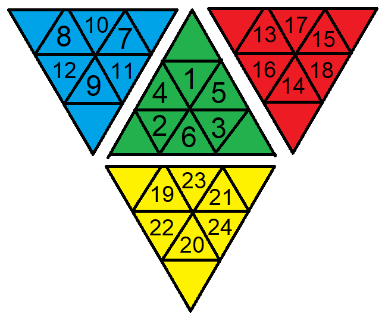

# CPE-512-Final-Project
Final project for CPE 512 at UAH.

This is a Pyraminx solver (but can be more generally used as a Pyraminx algorithm finder). A pyraminx is a twisty puzzle with 4 sides and 4 axes, and is a fairly simple puzzle to solve. This project allows a user to input a permutation of the puzzle, and find all of the solutions under a maximum move count `N`.

## Inputting the puzzle

The puzzle is inputted a sticker at a time in the following order:

Input single characters, lowercase. `r`=Red, `g`=Green, `b`=Blue, and `y`=Yellow. The orientation of the puzzle does not matter, so if you want to input with blue as the F face and red as the D face, the solver will not be hindered.

## Maximum move count

The maximum move count lets the solver know when to stop searching for moves. In general, keeping under 10 moves for 4-gen solves, or under 12 moves for 3-gen solves is a good idea. Compute time increases *exponentially* with increased move cap, so to avoid unnecessary processing, keep this number as low as possible!

## Axes permitted

You can restrict the axes that the solver is allowed to turn for a solve. For <LUR> 3-gen, enter `lur`. The order does not matter, so `rul` or `lru` also work.

## Maximum Thread Count

The program relies on massive parallelism to run fast, due to its implementation of a parallel BFS to find solutions instead of any sort of heuristic function. Because of this, by default, the program will consume 100% of your CPU time in order to find solutions. You can set an upper bound to the number of threads used. Input `0` to use the default number (max available). Input any other non-negative scalar to use that number of hardware threads.
